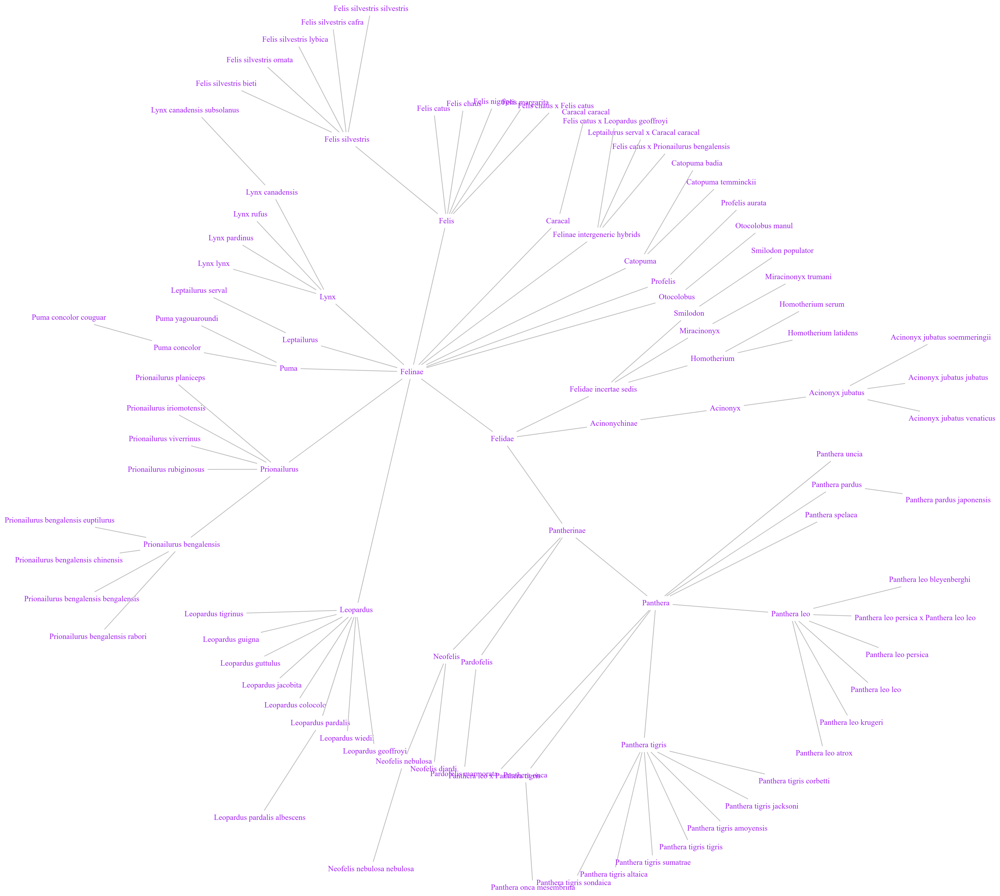

# Analise_de_dados_JSON
Análise de Dados JSON  
  
O ficheiro [mammals.json](../scripts/projeto2/dados/mammals.json) possui uma listagem da taxonomia de todos os mamíferos registado na base de dados [ENSEMBL](http://www.ensembl.org/index.html).
Este ficheiro foi extraído a partir da API [seguinte](https://rest.ensembl.org/documentation/info/taxonomy_id) que permite consultar individualmente elementos da taxonomia. Também é possível explorar a taxonomia no [site do NCBI](https://www.ncbi.nlm.nih.gov/Taxonomy/Browser/wwwtax.cgi).

A intuição é que a taxonomia forme uma árvore: espécies concretas (como humanos) são folhas; nodos intermédios da árvore são sub-categorias na hierarquia de mamíferos. 

Foram escritos programas Python que respondem às seguintes questões:

* Quantas espécies de mamíferos (folhas da árvore) estão registadas?
A função `totalEspecies`, retorna um número inteiro.
* Qual é o parente mais próximo entre duas espécies?
A função `parenteMaisProximo`, recebe o nome de duas espécies, por exemplo homens (*Homo sapiens*) e macacos japoneses (*Macaca fuscata*), e retorna o nome científico da categoria respetiva.

Também foi feita uma função `desenhaGatos` que gera um ficheiro `.dot` e representa um diagrama circular da taxonomia da família dos gatos (*Felidae*), como a seguinte imagem: 

  Para isso, utilizou-se a ferramenta [Graphviz](https://graphviz.org/) que gera diagramas a partir de ficheiros de texto no formato [DOT](https://graphviz.org/docs/layouts/dot/).

É possível inspecionar o template gerado em visualizadores online como [este](https://edotor.net/). 
